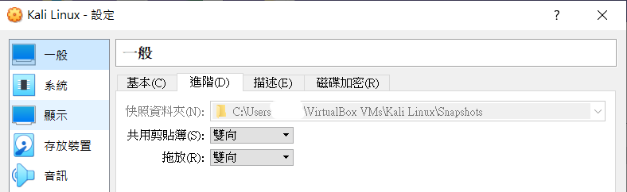
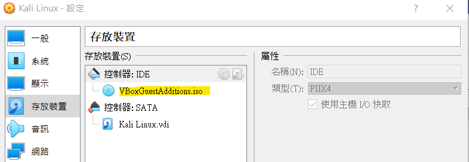

Kail linux 官網提供了很詳細的[安裝教學文件](https://www.kali.org/docs/virtualization/install-virtualbox-guest-vm/)，我們可以從virtualbox 的設定中看到我們開啟了 Shared Clipboard 功能。倘若你實際上卻無法與 host 主機共用剪貼簿，那就恭喜跟我一樣碰到 virtualbox 的老問題了。

> 也有可能是 Kail linux ISO 的問題，因為我同台 host 也裝了 ubuntu、centOS 的 vm 卻沒有此狀況。

還沒解完...明天再戰