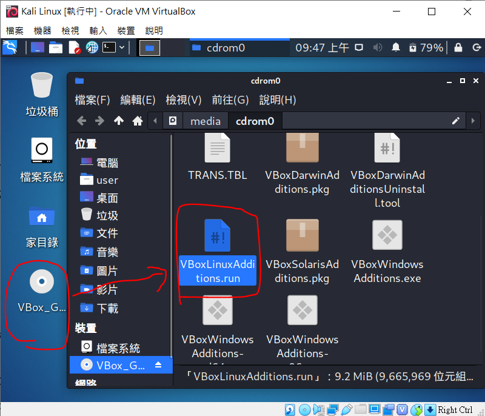
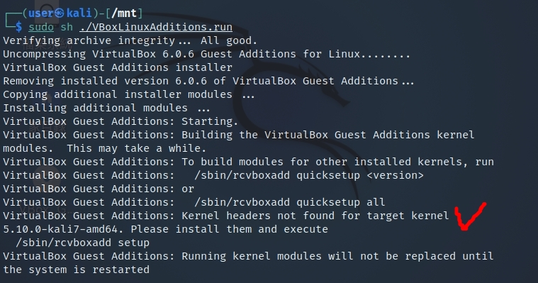

Kail linux 官網提供了很詳細的[安裝教學文件](https://www.kali.org/docs/virtualization/install-virtualbox-guest-vm/)，我們可以從virtualbox 的設定中看到我們開啟了 Shared Clipboard 功能。倘若你實際上卻無法與 host 主機共用剪貼簿，那就恭喜跟我一樣碰到 virtualbox 的老問題了。

> 也有可能是 Kail linux ISO 的問題，因為我同台 host 也裝了 ubuntu、centOS 的 vm 卻沒有此狀況。

## 正文開始

> 可參考英文論壇的解法 https://askubuntu.com/questions/22743/how-do-i-install-guest-additions-in-a-virtualbox-vm 或是中文翻譯版 https://ubuntuqa.com/zh-tw/article/66.html 或 https://www.jinnsblog.com/2021/05/virtualbox-guest-additions-install-guide.html。

因為我們已經在 virtualbox 的設定中加入了 GuestAddition.iso，因此可以在 vm 的桌面看到一個光碟機。點開來看裡面有 auturun 的執行檔，但是看起來就是沒有 work，需要手動安裝。如果你沒有在 virtualbox 設定中加入 GuestAddition.iso，須執行這項:


sudo apt-get update
sudo apt-get install virtualbox-guest-additions-iso


其他版本的 Linux 也許可以從檔案管理員執行 `VBoxLinuxAdditions.run` 這個 shellscript。但 kali 不行，首先我們要掛載這個映像檔然後執行它:


sudo mount /dev/cdrom /mnt              # or any other mountpoint
cd /mnt
sudo sh ./VBoxLinuxAdditions.run
reboot


雖然我在執行的時候噴 kernal header not found，但重開機後還是成功可共用剪貼簿了。

