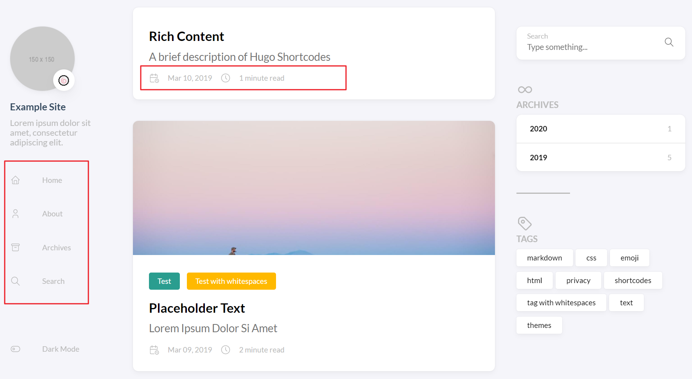
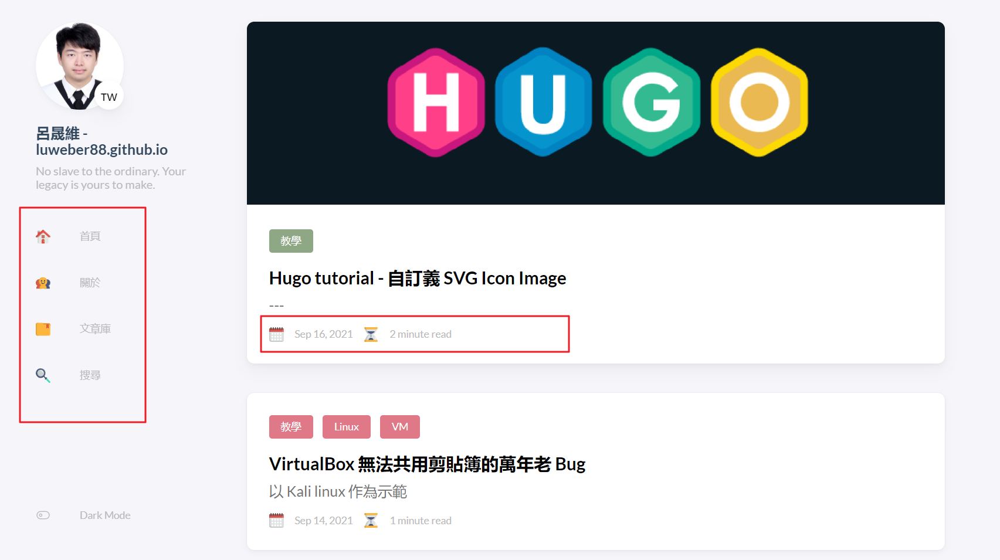

> :boy:: 才接觸 hugo 三天就來東改西改484搞錯了什麼。  
> :girl:: 要不要先去看個 YouTube 教學搞懂一下檔案結構和編譯方式呀?  
> :boy:: 有道理... [但是我拒絕.jpg](https://zh.moegirl.org.cn/index.php?title=%E4%BD%86%E6%98%AF%E6%88%91%E6%8B%92%E7%BB%9D&variant=zh-tw&mobileaction=toggle_view_desktop) !

## 修改前後比對




## Icon 的存放目錄

依照此模板官網的說法，預設的 SVG icon 放在 theme 目錄底下，即為 `themes/hugo-theme-stack/assets/icons` 目錄，為了方便起見我將我自己下載的 icon 資料夾放在同一個目錄中。其實你也可以放在 hugo 專案的 `/assets/icons` 底下。

在設定檔中，圖檔名稱是可以包含路徑的，而網站在編譯時會自行加上副檔名:
- 預設: *iconname*
- 自定義: *subfolder/iconname*

## 修改左側 Sidebar 上的圖示

### 首頁圖示

參照作者的文件: https://docs.stack.jimmycai.com/configuration/custom-menu.html。

左側的 Sidebar 又稱菜單或 Menu，可以從(1) `config.yaml` 檔中設定，或是從(2) */content/page* 底下 md 檔的標頭(Markdown Front Matter)設定。首頁圖示以及其他項目只能從 config 檔中設定，格式為:

```yaml
menu:
    main:
        - identifier: home
          name: 首頁
          url: /
          weight: -100
          pre: blog-lineal/home
          params:
              ### For demonstration purpose, the home link will be open in a new tab
              newTab: false
```

- `identifier`: Item ID (指該 menu item 對應到哪個檔案??)
- `name`: Display text (左側選單上 menu item 的文字)
- `url`: Link (該頁面的路由)
- `weight`: Priority of the item, lower value means higher priority. (排序，數值越小越上面)
- `pre`: Specify which SVG icon should be used (圖示)

像是我將 `pre` 改設為 `blog-lineal/home`, theme 就會自動抓取 *assets/icons* 目錄底下的 `blog-lineal/home.svg`。

### 其他 Page 的圖示

其他 menu item 裡的頁面，模板預設寫在 */content/page* 的 md 檔中，以我的"文章庫"為例，一樣將 `pre` field 改成我的 svg 圖片檔名。當然你想要把 `menu:` 這部分挪到 config 檔裡統一設定也 OK。


```yaml
---
title: "文章庫"
date: 2019-05-28
layout: "archives"              # 哪種頁面樣板
slug: "archives"                # 路由
menu:
    main:
        weight: -70
        pre: blog-lineal/folder # icon
---
```

### 修改頭像

順帶一提，大頭貼、副標題和網站名稱都可以在 config 中編輯。

```yaml
sidebar:
    emoji: 🇹🇼
    subtitle: No slave to the ordinary. Your legacy is yours to make.
    avatar:
        enabled: true
        local: true
        src: img/avatar_cap_and_gown.jpg
```

## 修改文章發表日期、閱讀時間的圖示

> 做下去才發現這個超難搞 ><  
> 個人化修改可以參考: https://docs.stack.jimmycai.com/modify-theme/

剛剛修改左側 Sidebar 時已經確認在整個 config.yaml 中 `pre` field 只存在 Custom menu 的設定值裡，設定檔沒有其他地方使用 `pre` field 來指定日期時間小圖示的檔名。在 `/page` 的 FrontMatter 表頭裡也沒有這兩個圖示的賦值語法。恩...這下尷尬了，不知道它藏在哪裡。

由於官方文件對於 [Date format](https://docs.stack.jimmycai.com/configuration/#date-format) 沒有多做描述，我們在 theme-stack 專案的 [feat(article): reading time #204](https://github.com/CaiJimmy/hugo-theme-stack/pull/204) 這個 pull request 中看到文章發表日期的圖示是 date.svg，以及閱讀書間的圖示是 time.svg (由下文推敲出次圖示於後來的版本被改成 clock.svg)。

但還有一件事我們可以確定，就是這兩個 icon 的賦值一定存在專案的某個檔案片段，可能寫死在 theme 的 md 或是 html 裡面不讓使用者自訂義。所以還可以遍歷專案尋找哪裡有 date 或 time 字串。於是我打開 cmd 切到專案目錄下並輸入:

```Bash
$ grep -r "date" .
'grep' 不是內部或外部命令、可執行的程式或批次檔。
```

蝦? 原來 windows 作業系統沒有 [grep 指令](https://stackoverflow.com/questions/1987926/how-do-i-grep-recursively)，還好有雷同的 [findstr 指令](https://docs.microsoft.com/zh-tw/windows-server/administration/windows-commands/findstr)，記得將結果輸出到 out.txt 不然直接 print 在 cmd 上往往會因字體編碼出錯。來試試:

```Batchfile
$ findstr /si date *.* >> out.txt 
```

打開 out.txt，看到 "helper/icon" "date" 這些關鍵字。

```text {linenos=table, hl_lines=[5], linenostart=268}
themes\hugo-theme-stack\i18n\zh-CN.yaml:    lastUpdatedOn:
themes\hugo-theme-stack\layouts\page\search.json:    {{- $data := dict "title" .Title "date" .Date "permalink" .Permalink "content" (.Plain) -}}
themes\hugo-theme-stack\layouts\partials\article\components\details.html:    {{ if or (not .Date.IsZero) (.Site.Params.article.readingTime) }}
themes\hugo-theme-stack\layouts\partials\article\components\details.html:        {{ if not .Date.IsZero }}
themes\hugo-theme-stack\layouts\partials\article\components\details.html:                {{ partial "helper/icon" "date" }}
themes\hugo-theme-stack\layouts\partials\article\components\details.html:                    {{- .Date.Format (or .Site.Params.dateFormat.published "Jan 02, 2006") -}}
```
接著把 `themes\hugo-theme-stack\layouts\partials\article\components\details.html` 翻出來看看，哇! bingo! 就是這個檔案指定了日期時間的小圖示。看來他是寫死在這個 component 裡面所以就只能修改這個 html 了。

注意! 因為是修改 theme 的預設樣式，所以我們的 svg 圖檔資源要放在 `themes\hugo-theme-stack\assets\icon` 裡，理當不能放在自己的 hugo 專案裡，如果你自己放了一包圖檔在資料夾中，圖檔名稱是可以包含路徑 e.g. `blog-linear/hourglass.svg`。

( Windows 的 dir 是 `\` 反斜線，故意跟其他作業系統/程式語言不一樣。這裡 html 中的路徑須為 `/` 斜線 )

```html {linenos=table, hl_lines=[5,14], linenostart=24}
{{ if or (not .Date.IsZero) (.Site.Params.article.readingTime) }}
<footer class="article-time">
    {{ if not .Date.IsZero }}
        <div>
            {{ partial "helper/icon" "date" }}
            <time class="article-time--published">
                {{- .Date.Format (or .Site.Params.dateFormat.published "Jan 02, 2006") -}}
            </time>
        </div>
    {{ end }}

    {{ if .Site.Params.article.readingTime }}
        <div>
            {{ partial "helper/icon" "clock" }}
            <time class="article-time--reading">
                {{ T "article.readingTime" .ReadingTime }}
            </time>
        </div>
    {{ end }}
</footer>
{{ end }}
```

## 小結

一路 trace code 改下來真的很花時間，如果是修改一般的網頁模板的圖示應該會比較輕鬆(不論是純JS或是三大框架)，只要對專案 CTRL+F 就可以找到哪裡引用了圖示資源再改掉他就好，哪像 hugo 這麼抽象化。

這個案例凸顯 Hugo 為了增加可擴充性，必須犧牲掉部分的可讀性，尤其是針對無法擴充的部分，所以在開發時設想哪些功能未來會被擴充很重要阿，後期增加的 features 要顧慮到這點也就更難了。正是 OOP open–closed principle 的寫照:

*"Software entities should be open for extension, but closed for modification." - Robert C. Martin's 1996*
