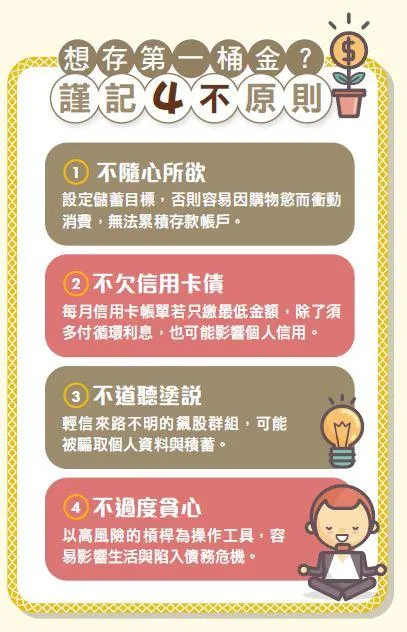
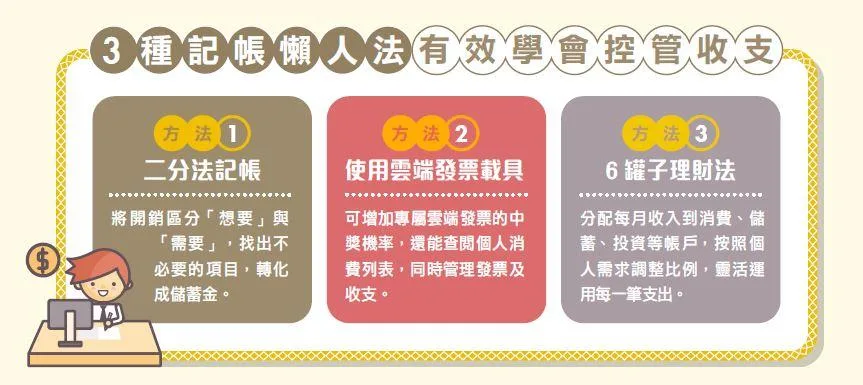

> 趁著剛開學讀了一些理財書籍，我大學往往會排斥修財金課程，因為學的都是企業向的財務會計，無法應用在個人理財上。剛好滑到這篇文章覺得內容已經囊花了許多理財書籍的重點，這4個觀念也可以再鑽研探究，文字淺顯但值得省思。  

> 原文:point_right: [選股、存錢好困難？用４觀念＋３方法 輕鬆存下第一桶金，以後退休還能 每月多領１萬塊！ | 2021年9月10日](https://tw.news.yahoo.com/%E9%81%B8%E8%82%A1-%E5%AD%98%E9%8C%A2%E5%A5%BD%E5%9B%B0%E9%9B%A3-%E7%94%A8-%E8%A7%80%E5%BF%B5-%E6%96%B9%E6%B3%95-060900366.html)

**正式告別校園、踏入社會的職場新鮮人，不僅開始累積工作經歷，同時也需要由下至上堆砌經濟獨立的基石，最恰當的方法是建立良好的儲蓄習慣及培養正確的理財觀念，如果缺乏財務規劃，可能會延後實現買房、結婚、退休等人生各階段的目標。**

事實上，理財會隨著不同年齡階段而有不同的執行方法，建議新鮮人先存到至少6個月生活費的緊急預備金，以此當成儲蓄起點，並正視自身的理財盲點，逐一擊破無法存到錢的原因。上班領到第一份薪水後，究竟該如何逐步累積財富呢？以下提供4個學習歷程，教你按部就班學會理財這件事。

## 觀念1: 練習小額儲蓄 靠紀律存第一桶金
即使知道儲蓄很重要，如果缺乏循序漸進的方式，在尚未養成存錢習慣前，很容易一不小心就受到商品促銷、團購優惠等誘惑而衝動購物，讓儲蓄帳戶如同破水桶，無法留住積蓄。

對此，理財YouTuber李勛建議，理財零基礎的新鮮人應該先設定一個清楚、可行的目標，像是從存10萬、50萬元開始，一旦存到特定金額就適當地犒賞自己，才會更有動力存錢，同時培養記帳習慣，最簡易的方式是使用二分法記帳，區分「需要」和「想要」，找出能夠節流的開銷。

李勛表示，只要持續記帳1個月就能了解個人花費項目，檢視哪些是能減少的支出，將可以省下來的金錢變成儲蓄，充分運用每一筆資金。善用記帳App或是使用雲端發票載具查看收支，了解自己基本開銷後，再擬訂每月花費上限，憑藉紀律與強迫儲蓄，很快就能存到人生中的第一桶金。

> :question: *Q: 記帳固然重要，但一旦你有數個戶頭，多種支出(現金、信用卡、轉帳、悠遊卡)，有時候會想說記了半年一年後 balance 兜不上了要不要關帳? 悠遊卡、xxPay自成一個戶頭好麻煩! 手機APP沒有電腦版R，就算有雲端備份還是只能在手機上看! 諸如此類的小問題學校當然不教~*

## 觀念2: 提升專業技能 有效加快存錢腳步
已經有儲蓄習慣、想提升每月存款比例，但暫時沒有其他開源方式的小資族，理財YouTuber「懶錢包Lazy Wallet」摳摳建議，先增進個人本業專業技能、強化職場競爭力，以獲得加薪或職位晉升的機會，儲蓄力也就能隨之提高。

摳摳以過來人經驗分享，剛出社會的年輕族群雖然收入不高，卻更能利用這段時期擴增相關技能，如同一塊海綿不停地吸收養分，同時藉由閱讀、觀看YouTube頻道、聆聽Podcast等方式學習理財知識，從中汲取對儲蓄有助益的方法。

此外，摳摳提到，暢銷書《有錢人跟你想的不一樣》作者T．哈福．艾克（T. Harv Eker）提出「6罐子理財法」，將每月收支分成6個帳戶：財務自由帳戶（10%）、教育帳戶（10%）、生活必需帳戶（55%）、玩樂帳戶（10%）、支出用長期儲蓄帳戶（10%）、贈予帳戶（5%），理財新手可以運用這個方法將收支分門別類，視個人情況調整項目與比例，讓儲蓄更能事半功倍。

> :question: *Q: 儲蓄帳戶是支出用長期儲蓄帳戶?? 那財務自由帳戶是??*

## 觀念3: 每月投資3千元 10年後資產勝定存1.4倍
養成儲蓄習慣後，可以進一步在投資領域學習，藉由股票、基金等投資方式，將獲得的股利再長期投入，以此養大資產。

以每月3,000元定期定額買元大台灣50 ETF（0050）、年化報酬率7%試算，10年後將擁有約51.6萬元資產，相對的，如果每年將36,000元存放銀行、以定儲利率0.84%試算，10年後僅約擁有37.7萬元資產。

定期定額投資0050，等於一次買進台灣50家好公司的股票，沒有選股問題，是最適合新手的投資方式之一，用這種簡單的「無腦投資法」，10年後累積的資產約是定存的1.4倍，一旦日後薪資提升、累積更多投資知識與經驗後，隨著投資金額增加，獲利效益將更可觀。

根據證交所公布截至今（2021）年7月的證券開戶統計資料，已累積超過1,175萬人開戶，其中年齡20～30歲的開戶數較前月增加約4.09萬人，顯示有更多年輕族群進入股市，想透過較高的投資效益滾大儲蓄帳戶。

> :question: *Q: 老話一句，不要買個股，但總要學看股市。*
>    - [ETF_news_link](https://finance.ettoday.net/news/2093682) 
>    - [another_link](https://www.mirrormedia.mg/story/20210902money002/)

## 觀念4: 勞退自提6% 退休後每月多領1萬元
此外，《Money錢》顧問團建議，年輕人從領到第一份薪水開始「勞退自提6%」，也就是每月除了雇主依《勞工退休金條例》，按照個人薪資的6%提繳勞退基金之外，勞工也能再提撥最多6%的薪資到勞退帳戶，每月最高可提繳12%，自提部分還能享減稅優惠。

今年22歲的小源每月收入3萬元，假如每月只有雇主提撥的6%，每年薪資成長率1%，勞退帳戶投資報酬率3%，預估工作43年後可以領取勞退金，經勞工個人勞退新制退休金試算，累積退休金及收益達227萬元，退休後每月可領1.2萬元。

除了雇主提繳的6%，若是小源每月再自提6%，在相同的條件之下，累積退休金及收益則能達454萬元，退休後每月可領2.5萬元，相較於只有提繳6%多了2倍以上。隨著日後職務專業度、年資漸增，每月收入也會再增加，若能持續自提6%，累積的勞退金效益將更大。

> :question: *(1)論勞保對8年級生的付出與回饋  (2)勞退怎麼算*

## 別過度消費、別槓桿操作 謹慎避開2大財務破口
最後要提醒的是，職場新鮮人應避免做出會影響理財計劃的事，參考李勛與懶錢包團隊的經驗，應先衡量個人收支及還款能力，再執行大額支出的消費，例如買車。此外，申辦信用卡消費能獲得現金、點數回饋，替荷包省下一筆錢，不過，若是選擇每月帳單只繳最低金額，須負擔循環利息，不僅增加還款壓力，更可能造成信用瑕疵，影響日後申貸成功的機率。

此外，任何投資都具有風險，沒有保證獲利而不會虧損的工具，近期許多不肖人士以電話、簡訊、通訊軟體等方式，向投資人遊說「獲利100%、穩賺不賠」的投資方式，假如投資人輕信，可能求償無門，更讓積蓄付之一炬。

王道銀行存匯支付部資深協理徐佩琳表示，即使是合法的投資工具，想要獲得高報酬，勢必承受高風險，建議年輕族群不以融資、融券等槓桿方式操作，或是接觸不熟悉的個股當沖、期貨等交易，除了影響上班思緒，一旦操作不慎，會讓本金有去無回，進而肩負沉重債務，反而讓理財計劃窒礙難行。

