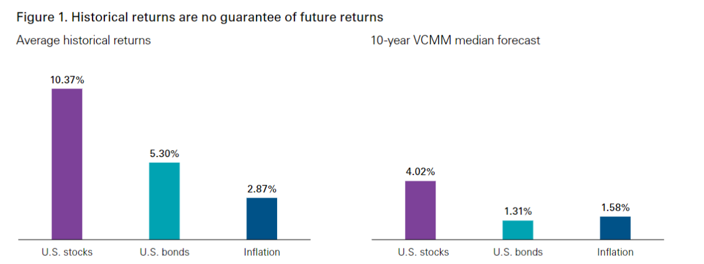
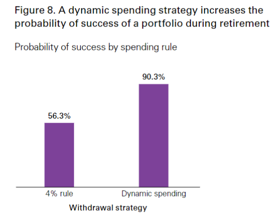
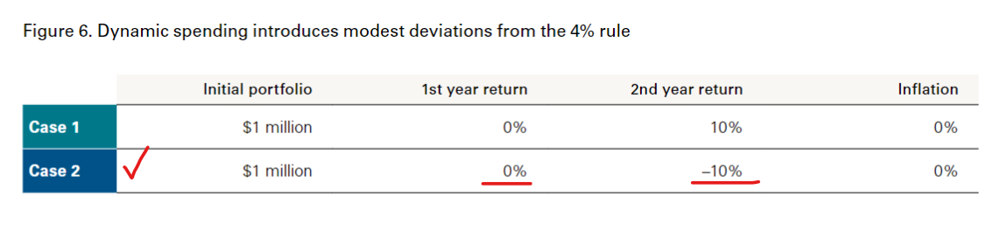
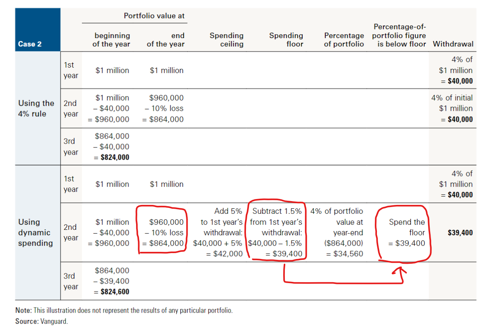

> 引用原文:point_right: [退休金「黃金4%法則」慘被打臉？高通膨年代得改用「這策略」！ | 2021-10-06](https://www.gvm.com.tw/article/83033)  
> 分析報告:point_right: https://personal.vanguard.com/pdf/ISGFIRE.pdf

> 讀者觀點，我們能從這篇文章學到甚麼?
>   - 退休金的4%黃金法則
>   - 退休金的動態提領策略
>   - 股債各半的資產配置 (文章欠詳述但值得研究)

**最近美國、台灣均釀股災，全球通膨卻仍漲不停，這讓退休財務遭到空前考驗。不少財務專家擔憂，計算退休金的「4%黃金法則」在高通膨年代有可能失效。連該法則的發明人，與美國著名的先鋒指數基金公司，近期都提出新研究表示，舊有預設不夠穩當，甚有老本提早花光風險，退休族需要調適應變。**

「4%法則」到底是什麼？原來，這是1994年，由美國財務顧問威廉．班根（William Bengen）所提出，用來計算合理退休金的黃金法則。

由於班根追蹤近30年美國股市大盤報酬，發現每年平均回報約為7至8%，若扣掉2～3%通膨後的年報酬率，則約為5%。所以，如果有人一年只提領老本中僅4%的金額，同時妥善做股債各半的投資配置，由於提領支出不會超過每年平均5%的報酬，這個人就可以年年提領不必擔心花光，達到退休要求。

換句話說，若有人一年花費約100萬，依照4%法則，這個人只要存到2500萬就夠，因為2500萬的4%就是100萬，或可以直接把年花費乘以25倍更好計算。這個退休金的標準不高，因此深獲許多想提早退休的年輕人歡迎，包括前外資分析師楊應超，都善用此法則做理財規劃，在48歲成功退休。

然而，去年底全球股市進入高檔、通膨也蠢蠢欲動，《富比世》便分析指出，「4%法則」在此狀況下，勢必讓退休族未來難有便宜股票可撿、同時卻面臨物價上升，被迫支出更多；而連原先用來保護報酬的公債，也因政府濫發熱錢、殖利率接近零，有可能讓老本提早花光。該怎麼辦？

**讀者QA**

:question: 4%法則是指退休後的現金來源為 **(1)以2500萬投資的報酬(本金的4%)當作生活費，而不花費本金**，還是 **(2)每年提領2500萬的4%本金當作生活費**?  
:speech_balloon: 4% of initial $1 million，所以是(2)提領本金的4%(or動態調整為4%+-offset)，而(1)投資報酬又可補足本金。如圖。

:question: 股債各半是只2500的退休金全數投入股票和債券? 需花費時再兌現? 這樣很不實際吧?  
:speech_balloon: 全數投入。Bengen (1994) calculated the maximum percentage  that retirees could withdraw annually from their portfolio without running out of money over 30 years. Advisors refer to this percentage as the safe withdrawal rate.

:question: 此份報告是針對美國民眾和市場的統計，龍蝦無法煎出牛排的味道，股債各半的投資模式適合台灣嗎?  
:speech_balloon: dunno。

## 4%行不通，乾脆4.5%花更多？

其實，就連此法則的發明人班根，都注意到上述變數的威脅。

他近期與另一位財務顧問麥可．奇斯（Michael Kitces）重新研究，將美國1968年曾歷經停滯性通膨、股市低迷的最糟狀況納入模擬，推翻原先說法，推出全新「4.5%法則」。

為什麼新的法則，竟讓每年提領比例從4%變為4.5%？主要是班根認為，在物價飛漲預期下，要退休族再掐緊荷包實在太辛苦，不如適當擁抱股市、以合理風險換取較高收益。

## 新法則關鍵在「資產配置」

但是在資產配置上，原先班建議的股債各半規劃，是大型股與美國中期公債各五成的配比。現在則改為30%大型股；20%小型股；50%美國中期公債的配比。

由此可見，新法則是運用成長潛力較高的小型股，來提高整體報酬，讓退休族支出可以更充裕。班根指出，以全新的模擬回測來看，30年內的投資平均年報酬，維持在7%上下，絕對能支應4.5%的花費比例。

另外，他也呼籲，無論4%或4.5%，僅是第一年的費用提領比例，未來還是要看各年通膨狀況做微調。

不過，美國首創追蹤大盤ETF、許多退休族最愛的先鋒（Vanguard）基金公司，則認為班根理論充滿漏洞。

[先鋒團隊今年中提出研究報告指出](https://personal.vanguard.com/pdf/ISGFIRE.pdf)，不論是4%或4.5%也好，這個法則最大問題是，它當初只是為了美國平均60歲左右人士，屆齡退休的30年內狀況來設計。然而，根據他們調查，千禧世代都傾向提早於50歲前就退休，在人類普遍壽命更長的預期下，至少得把退休後預設時間範圍，拉長到50年才行。當時間一長，各類黑天鵝發生的機率勢必大增。

## 先鋒示警：拉長到50年，「4%法則」成功機率僅剩36%

事實上，根據先鋒基金團隊模擬股市上百種變化的數據顯示，4%法則若維持在30年內，成功實踐退休夢的機率尚有81.9%；若拉長到50年，就僅剩36%。屆時每三個提早退休族，就至少會有一人得在年事已高的階段，還得回頭找工作賺取收入。

而這個數據，還未考慮到政府稅率和交易手續費。誰會知道，幾十年後，政府加稅的幅度將有多大？

至於班根用歷史回測，就樂觀斷定股市報酬一定能抵過通膨與每年固定花費，在先鋒團隊看來也覺得太天真。

## 「動態提領策略」較能應付不同年代危機

難道人們就得打消提早退休的美夢？先鋒基金公司倒不這麼認為，根據他們的研究顯示，如果採取「動態提領」策略，比較能因應不同年代的風險。

首先，妥善計算過每年花費，同時設定一個年花費上限天花板以及下限，也許是平均年花費再往上加5%；或往下扣1.5%。接著定期於每年底，看待當年股市投資報酬的狀況作明年費用規劃。

如果，今年投資報酬是正20%，遠高於你原先設定的報酬目標，那麼花費就可以大方一點，只要別超過年支出的上限即可；但如果今年投資報酬僅剩1%，或甚至為負，那明年就得節省一點，別低於該年支出的底線即可，但建議同步撥更多錢到股市。因為報酬差，通常代表股市已進入低檔，較有便宜可撿。

以今年以來台股與美股大盤表現來看，目前股市報酬都還相當正面，算是好年。但若年底漲幅吐回，以動態提領策略來看，退休族就得看狀況調低明年花費。

無論你覺得4%、4.5%法則較優；還是先鋒基金建議的「動態提領」策略較符合現實，這些在在說明了，退休後的花費很難估算，光是通膨改變就能打掛原先預設，而且時間愈長、意外愈多。

想提早退休的人，規劃之前請多考慮上述變數，以免往後還得摸摸鼻子回來上班。

## Case Study

幫遠見雜誌補充個案例，我只貼 case 2 即第一年投資報酬率 0%，第一年投資報酬率 -10% 的情況下，該怎麼提領的試算。

