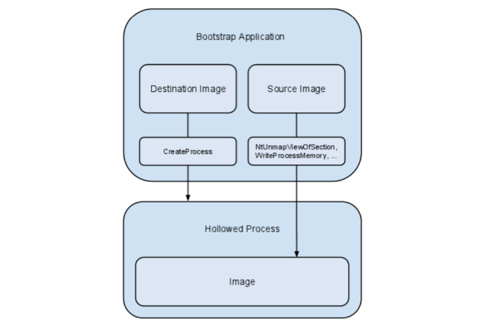
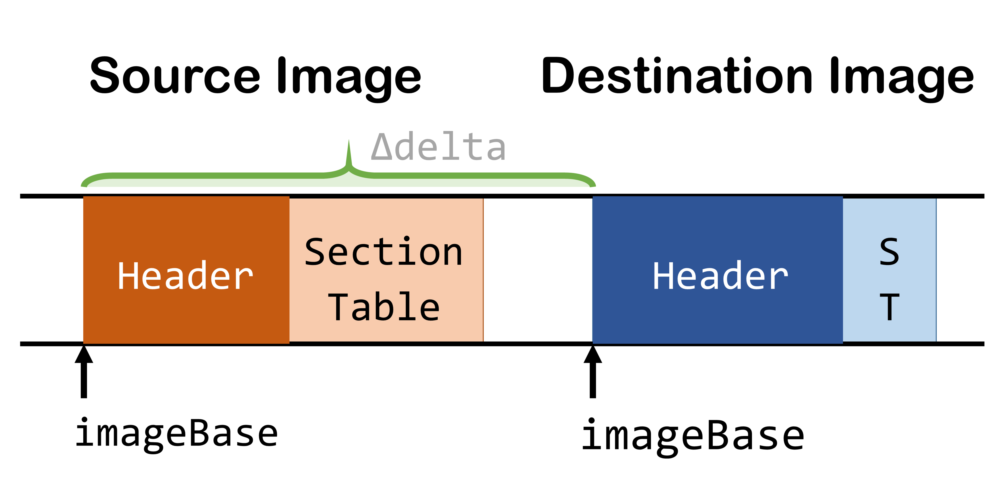

這篇文章將會介紹 Process Hollowing 的原理並輔以程式碼片段加以解說。 根據 Mitre att&ck 的分類，Process Hollowing 是 Process Injection 的一門子類別，又可稱為 cross-process injection。這次的程式展示將以 Windows 作業系統為目標，Windows 的執行檔統稱 portable executables (PE)，因此此項技法又名為 Portable Executable Injection。

```text  
Tactics: Privilege Escalation, Defense Evasion
Techniques: Process Injection
```

## 什麼是 Process Hollowing

Process Hollowing 是將惡意程式碼植入至 suspended 的 Process (執行緒)，達到可執行任意程式碼(arbitrary code execution)的目的，藉此偽裝被劫持的執行緒，繞過防毒軟體、應用程式偵測等防禦機制。最常見的範例是攻擊者自行 spawn 一個正常的 process，如 cmd.exe、svchost.exe，並且直接將其設為 suspend mode。

接下來有兩種做法，一是將惡意程式寫入原本 process 的 Image 中，二是另外分配一段記憶體給惡意程式再將原本 process 的 ImageBase 和 EntryPoint 指向新分配到的記憶體。最後攻擊者將 process 恢復執行即可掛羊頭賣狗肉的執行惡意程式了。

要注意的是，Process Hollowing 的權限是依據當前使用者的權限，或繼承父執行緒權限。若我們只 compromise 到一般使用者的帳號或執行階段(Session)，則只能獲得該使用者的權限。

技高一籌的攻擊行為是 Hijacking，攻擊者必須找到由 system admin 執行的 process 並且嘗試植入惡意程式，藉此獲得 admin 權限；找到 admin 權限的執行緒很容易，Hijacking 的精隨在於如何讓執行中的 process 進入 suspend mode 並知道它的 Image section 以 inject。

在教學之前，以些情境與名詞要先定義好:

- **Executable**: Executable is a compiled form of a Program (HelloWorld.exe file) [[i]](https://stackoverflow.com/questions/12999850/what-are-the-differences-between-a-program-an-executable-and-a-process)
- **Process**: Process is the executable being run by OS (an active program). The one you see in Task Manager or Task List (HelloWord.exe Process when we double click it.) [[i]](https://stackoverflow.com/questions/12999850/what-are-the-differences-between-a-program-an-executable-and-a-process) Process (行程)本身不是基本執行單位，而是Thread (執行緒)的容器。Process 需要資源才能完成工作，如CPU、記憶體、檔案以及I/O裝置。[[ii]](https://totoroliu.medium.com/program-process-thread-%E5%B7%AE%E7%95%B0-4a360c7345e5)
- **Thread**: 略。
- **Image / Process image**: 執行檔運行後被載入至記憶體(RAM)時，這個記憶體區塊便稱為 Image。Executable files are loaded into the address space of a process using a memory mapped image file. [[i]](https://www.tutorialspoint.com/inter_process_communication/inter_process_communication_process_image.htm) [[ii]](https://docs.microsoft.com/en-us/windows-hardware/drivers/ifs/executable-images)
- **Source image**: The memory space of malicious process. (*virus*)
    - Source = Mallicious code = Malware = 惡意程式。
- **Destination image**: The memory space of a legitimate process spawned by adversary. It is the target to be injected. (*victim*)
    - Destination = Target。
- **ImageBase**: Image file 的起始位址。 The preferred address of the first byte of the image when it is loaded in memory. The default value for DLLs is 0x10000000. The default value for applications is 0x00400000. [[i]](https://docs.microsoft.com/en-us/windows/win32/api/winnt/ns-winnt-image_optional_header32)
- **EntryPoint**: Image file 的進入點位址，也就是 stackframe of main 的起始位址。The address to the entry point function of the process/image. [[i]](https://docs.microsoft.com/en-us/windows/win32/api/winnt/ns-winnt-image_optional_header32) The location in memory where the first instruction of execution will be placed. [[ii]](https://en.redinskala.com/finding-the-ep/)
    - **EntryPoint** = **ImageBase** + **AddressOfEntryPoint** (offset)

關於更多關於 PE file 的知識可以參考下方介紹。

## 逐步拆解 Process Hollowing 的運作

### 簡略流程

我們來看看 MicroSoft 對於 Process Hollowing 的介紹。

原文:point_right: [Process hollowing and atom bombing](https://www.microsoft.com/security/blog/2017/07/12/detecting-stealthier-cross-process-injection-techniques-with-windows-defender-atp-process-hollowing-and-atom-bombing/)。

While there are few known techniques that achieve process hollowing, the most common variant typically follows **four steps** to achieve stealthy execution of malicious code:

- The malware **spawns a new instance of a legitimate process** (e.g., explorer.exe, lsass.exe, etc.), and places it in a **suspended state**.
- The malware then **hollows out the memory section** in the new (and still suspended) process that holds the **base address** of the legitimate code. To do this, the malware uses the *NtUnmapViewOfSection* routine.
- It allocates **read-write-execute (RWX) memory** in the suspended process to prepare for the replacement malicious code.
- The malware then **copies malicious code** into the allocated memory. It changes the target address of the **first thread** to the malicious program’s **entry point**.

When the thread resumes, the malicious code starts running, now disguised as a legitimate process. The malware is then free to delete remnants of itself from disk to avoid detection.

### 詳細流程

這篇引用 Autosectools.com 的 PDF 文件做更詳細的介紹。我們直接來看範例程式的輸出結果(stdout)來回推過程，其實不論是攻擊思路和程式都很直觀。

原文:point_right: https://www.autosectools.com/process-hollowing.pdf。



1. **Creating destination process**

    Adversary 以合法的方式開啟一個 target process，並以 suspended state 執行。由於 target process 是我們親手建立的因此可以掌握它完整的資訊(PROCESS_INFORMATION)，如 pid 和 handle 等資訊。因為我們等等需要把 target process 跟它的記憶體區塊脫鉤，也要讀取它在 register 中的資訊，因此直接讓它進入 suspended state，待我們 inject 惡意程式之後再啟動它。

    備註:
    
    - *Handle* is a reference to a process。[[i]](https://stackoverflow.com/questions/12424045/what-is-the-difference-between-handle-and-thread) [[ii]](https://en.wikipedia.org/wiki/Handle_%28computing%29)
    - *Process Creation Flags*: CREATE_SUSPENDED - The primary thread of the new process is created in a suspended state, and does not run until the *ResumeThread* function is called.。[[i]](https://docs.microsoft.com/en-us/windows/win32/procthread/process-creation-flags)

    

1. **Opening source file**

    讀入 source PE file (惡意程式碼的執行檔)。

1. **Unmapping destination section**

    使用 C++ 的 `NtUnmapViewOfSection()` 方法將 target process 先前分配給行程的記憶體 unmap 掉。在第 8, 9 步我們會將 target process 的 memory section 指向第 2 步載入的惡意程式的 image。

1. **Allocating memory**

    接下來我們要使用 `VirtualAllocEx()`方法要求另一塊記憶體空間給 source process (要植入的惡意程式)。在 PE file 的 optional header 中，SizeOfImage 這個欄位會記錄 image 所需的記憶體大小，我們就依照這個欄位來分配新的記憶體給 source process。
    
    一般來說記憶體為了安全會依照可讀/可寫/可執行的用途來分配給不同 section，但我們簡化流程直接指定為可讀+可寫+可執行(RWX)。如果需要做到更好的偽裝則需按照 section 來分配不同安全層級的記憶體。

1. **Source image base: 0x00400000**
1. **Destination image base: 0x00A60000**
1. **Relocation delta: 0x00660000**

    有了記憶體空間，接下來要將 source image 的內容(*malware*)，複製到 destination image 上(*victim*)。需要經過兩階段才能複製完成整個 image，首先要複製 image 的 header，才能根據 header 的資訊複製各個 PE file section。

1. **Writing headers**

    在程式中，我們透過 `GetNTHeaders()` 函數的回傳值拿到一個 `PIMAGE_NT_HEADERS32 pSourceHeaders` pointer 指向表頭。

    如下圖所示，我們要將 source header 複製一份寫入 destination header，但小等一下，由於 PE 表頭的 `OptionalHeader.ImageBase` 欄位還記錄著 source 的 imageBase，必須把他改成 destination 的 imageBase 才能複製表頭，因為最後要 run 的是還是 victim process。
    
    而我們用 dwDelta (一個 dword 整數)紀錄 source imageBase 與 destination imageBase 兩者的位址差，下一步驟複製 section 時會用到這個偏移量。

    

    BTW，這篇教學在寫入記憶體時一律呼叫 `WriteProcessMemory()` 方法。

1. **Writing sections**
    - **Writing *.text* section to 0x00A8B000**
    - **Writing *.rdata* section to 0x00AE2000**
    - **Writing *.data* section to 0x00AF3000**
    - **Writing *.idata* section to 0x00AF7000**
    - **Writing *.rsrc* section to 0x00AF8000**
    - **Writing *.reloc* section to 0x00AF9000**

    在程式中，我們透過 `GetLoadedImage()` 函數的回傳值拿到一個 `PLOADED_IMAGE pSourceImage` [pointer](https://docs.microsoft.com/en-us/windows/win32/api/dbghelp/ns-dbghelp-loaded_image) 指向存有 image 各項資訊的結構。從結構中可獲取 `NumberOfSections` 的整數表示 image 中有幾個 section，以及 `Sections` 指標指向了 [IMAGE_SECTION_HEADER](https://docs.microsoft.com/en-us/windows/win32/api/winnt/ns-winnt-image_section_header) 結構。

    接著跟寫入表頭的方式一樣，使用 for-loop 依序把每個 image section 複製給 destination 即可。

1. **Rebasing image**

    這裡我看不懂，只知道如果偏移量存在(不等於零)要做這段與 relocation section 有關的操做。需要進行多次小片段的讀寫，會先呼叫 ReadProcessMemory()，再呼叫 WriteProcessMemory()。

1. **Getting thread context**
1. **Setting thread context**

    成功將 Mallicious code 植入進 destination image 了!! 但此時這個這個 process 是被 suspended 的，OS 會把這個 thread 的執行資訊(如:register暫存器的值以及program counter)保存起來放在 process control block (PCB) 的 [thread context](https://docs.microsoft.com/en-us/windows/win32/api/winnt/ns-winnt-context) 中，好讓該 thread 在被 CPU 再次執行時 resume 回先前的狀態，此動作稱為 context switch。
    
    當一個 process 被 swap 進 suspended state 時，EAX register[[i]](https://www.eecg.utoronto.ca/~amza/www.mindsec.com/files/x86regs.html)[[ii]](https://zh.wikibooks.org/zh-tw/X86_%E6%B1%87%E7%BC%96/X86_%E6%9E%B6%E6%9E%84) 的值會被當作/設為該執行緒的 EntryPoint。因此需要修改 thread context 裡的 EAX register 為植入後程式的 EntryPoint 之絕對位置 (EntryPoint = ImageBase + AddresssOfEntryPoint)。

    程式中的做法是 new 一個新的 context structure 來複製原本的 context 內容，將 EAX register 改成 source image (mallicious code) 的 EntryPoint；再把 context set 回去 destination image，讓執行緒重啟時能抓到並從 mallicious code's EntryPoint 從頭開始執行植入的程式，達到任意執行程式碼的攻擊成果。

1. **Resuming thread**

    要重啟 process 很簡單，呼叫 `ResumeThread()` 函數就好啦。OS 會把該行程加進 ready queue 等候執行。

1. **Process hollowing complete**

    我們的 cross-process injection 便大功告成囉，感謝各位的耐心收看! 有勘誤也歡迎指正。

## PE file 介紹

待補

## 程式碼展示

待補，可能會寫在上方流程裡

## Process Hollowing 所受的限制

待補

## QAs

**Q: 既然 Source image 會被覆寫掉為何要先 unmap 掉原本的記憶體空間?**

A: *因為原先的記憶體會有不同的 memory protection，比如說 .text section (which holds program code) 是 execute/readonly，兩邊的 section 大小不一置的話會有權限不符的情況發生。另外若 source image size < dest 的話覆寫完還會有記憶體殘值留下。*

**Q: 為何 EAX register 存放著 process 的進入點?**

A: *我不知道也查不到:cry:，c++和C#版的兩篇教學文都這樣說。*

## 參考

技術文章與實作 (超推必看)
- [Detecting stealthier cross-process injection techniques with Windows Defender ATP: Process hollowing and atom bombing](https://www.microsoft.com/security/blog/2017/07/12/detecting-stealthier-cross-process-injection-techniques-with-windows-defender-atp-process-hollowing-and-atom-bombing/), www.microsoft.com
- autosectools.com's PDF: https://www.autosectools.com/process-hollowing.pdf
- C++ version: https://github.com/m0n0ph1/Process-Hollowing
- C# version: https://github.com/wireless90/ProcessInjector.NET/tree/main/ProcessInjector/ProcessHollowing

Mitre Attack
- Process Injection https://attack.mitre.org/techniques/T1055/
- Process Injection: Process Hollowing: https://attack.mitre.org/techniques/T1055/012/
- Process Injection: Portable Executable Injection: https://attack.mitre.org/techniques/T1055/002/

Process State
- https://www.geeksforgeeks.org/states-of-a-process-in-operating-systems/

Threading
- Threads & Threading: https://docs.microsoft.com/en-us/dotnet/standard/threading/threads-and-threading
- Thread context: https://docs.microsoft.com/en-us/windows/win32/api/winnt/ns-winnt-context
- Context switch: https://en.wikipedia.org/wiki/Context_switch

Register
- https://www.eecg.utoronto.ca/~amza/www.mindsec.com/files/x86regs.html
- https://zh.wikibooks.org/zh-tw/X86_%E6%B1%87%E7%BC%96/X86_%E6%9E%B6%E6%9E%84
